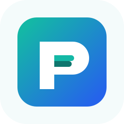

<div align="center">

<picture>
  <source media="(prefers-color-scheme: dark)" srcset="./website/docs/public/logo-dark.svg">
  <source media="(prefers-color-scheme: light)" srcset="./website/docs/public/logo-light.svg">
  
</picture>

<h1>skills-package-manager</h1>

<p>
  <strong>The Next-Gen Package Manager for <a href="https://skills-package-manager.site">Agent Skills</a></strong><br>
  Manage, install, and link SKILL.md-based skills from a single `skills.json` manifest.
</p>

<p>
  <a href="https://www.npmjs.com/package/skills-package-manager">
    
  </a>
  <a href="https://www.npmjs.com/package/skills-package-manager">
    
  </a>
  
  
  <a href="./LICENSE">
    
  </a>
</p>

<p align="center">
  <a href="#-quick-start">Quick Start</a> •
  <a href="#-features">Features</a> •
  <a href="#-how-it-works">How It Works</a> •
  <a href="https://skills-package-manager.site">Documentation</a>
</p>

---

</div>

## ✨ Features

- 📌 **Single-File Pins** — Keep exact git commits and npm versions directly in `skills.json`.
- 🌐 **Any Source, Any Skill** — Mix local `link:`, versioned `npm:`, or direct `git:` repos with ease—even sub-folders within `.tgz` archives.
- 🚀 **npx skills compatible** — A seamless, drop-in replacement. Swap `npx skills` for `npx skills-package-manager` and unlock more power.
- 🔌 **Native pnpm Integration** — The `pnpm-plugin-skills` hooks directly into your install lifecycle for zero-effort synchronization.
- 🛡️ **100% Open & Private** — Zero telemetry. No tracking. Purely client-side tooling that respects your privacy.
- 🧩 **One Install, Multiple Agents** — Stop folder duplication. Install once and link into `.claude`, `.cursor`, and custom agent directories simultaneously.

## 🚀 Quick Start

### Initialize a project

```bash
# Create a new skills.json manifest
npx skills-package-manager init --yes
```

### Add skills

```bash
# 🔍 Interactive — browse and select from a repo
npx skills-package-manager add rstackjs/agent-skills

# 🎯 Direct — specify skill by name
npx skills-package-manager add rstackjs/agent-skills --skill pr-creator
npx skills-package-manager add rstackjs/agent-skills -s pr-creator -s rspress-custom-theme

# 🔎 List without installing
npx skills-package-manager add rstackjs/agent-skills --list

# 📁 Local skill directory
npx skills-package-manager add link:./my-skills/my-skill
```

### Install all skills

```bash
npx skills-package-manager install
```

## 🏗️ How It Works

SPM uses one manifest file to manage your agent's capabilities:

1.  **`skills.json`**: The single source of truth where you declare pinned skill specifiers, `installDir`, and `linkTargets`.

## 📚 Documentation

Visit [skills-package-manager.site](https://skills-package-manager.site) for full documentation, API references, and architecture deep-dives.

## 🛠️ Development

```bash
pnpm install
pnpm build
pnpm test
```

## 📄 License

[ISC](./LICENSE) © 2026 SoonIter

---

<div align="center">

**[⬆ Back to Top](#skills-package-manager)**

Made with ❤️ for the AI Agent Ecosystem

</div>
