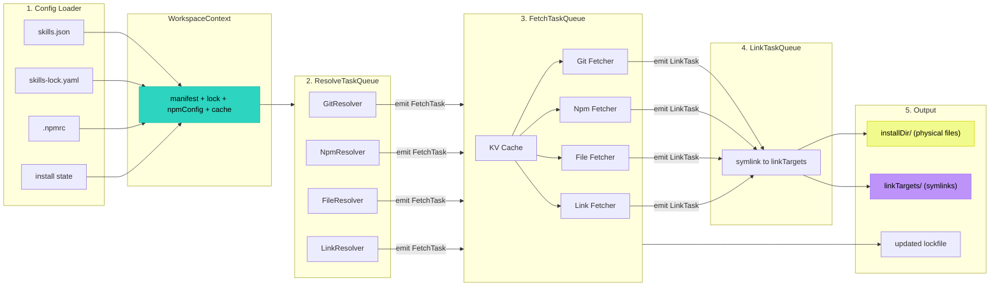
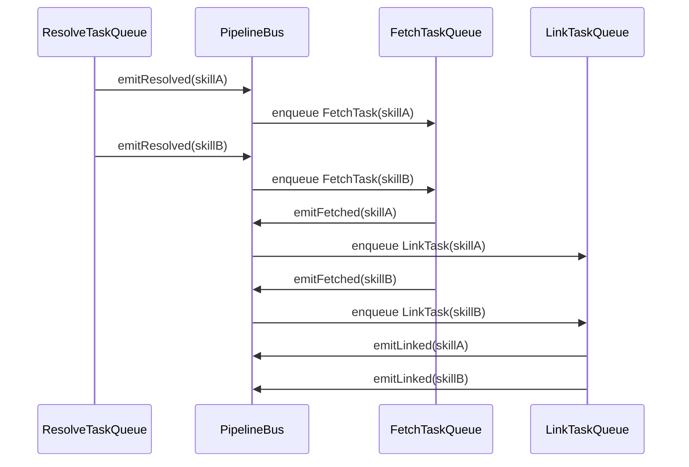

# How it works

The installation flow of skills-package-manager is built around a **unified pipeline** with three concurrent task queues: **resolve**, **fetch**, and **link**. These queues run in parallel with backpressure control, maximizing I/O throughput while keeping memory usage bounded.

## 1. Load configuration

The pipeline starts by loading all configuration into a single `WorkspaceContext`:

- `skills.json` (manifest)
- `skills-lock.yaml` (lockfile)
- `.npmrc` (npm registry config)
- `.skills-pm-install-state.json` (install state, if present)

This context is passed through every stage, eliminating redundant file reads and giving each queue access to shared state and cache.

## 2. Resolve specifiers

The `ResolveTaskQueue` resolves each skill specifier in parallel (default concurrency: 8):

- GitHub shorthand: `owner/repo`
- Git URL: `https://github.com/owner/repo.git`
- Git URL + `path:`
- Git URL + `ref` + `path:`
- Local `link:` skills
- Local `file:` tarballs
- `npm:` package sources

Resolvers are pluggable: each specifier type has its own resolver module under `src/resolvers/`.

## 3. Fetch into installDir

As soon as a skill is resolved, it is pushed to the `FetchTaskQueue` (default concurrency: 4). Fetching does **not** wait for all resolutions to finish — the pipeline streams results forward.

The fetch stage includes a **content-addressable KV cache** for npm tarballs and other downloadable assets, avoiding redundant network requests across installs.

Fetchers are also pluggable, living under `src/fetchers/`.

## 4. Link to target directories

Once a skill is fetched, it flows into the `LinkTaskQueue` (default concurrency: 16), which creates symlinks from `installDir` to each `linkTarget` directory (e.g., `.claude/skills`).

## 5. Prune old skills

Before any fetch begins, the system prunes skills in `installDir` that are no longer in the manifest or lockfile, preventing stale content from accumulating.

## Pipeline architecture

## Pipelining & backpressure

- **Backpressure**: If `FetchTaskQueue` exceeds 20 pending tasks, `ResolveTaskQueue` pauses. If `LinkTaskQueue` exceeds 20 pending tasks, `FetchTaskQueue` pauses.
- **Concurrency limits**: Resolve (8), Fetch (4), Link (16). These can be tuned per command.

## Design goals

The goal of this flow is not to treat skills as ordinary npm packages, but to bring "AI agent capability units" into an engineering workflow:

- **Declarative**: `skills.json` is the single source of truth.
- **Reproducible**: `skills-lock.yaml` pins exact versions and digests.
- **Linkable**: One install, many agent directories.
- **Updatable**: Selective updates with `spm update`.
- **Auditable**: Every resolution and fetch is recorded.
- **Concurrent**: Pipeline parallelism minimizes install time.
