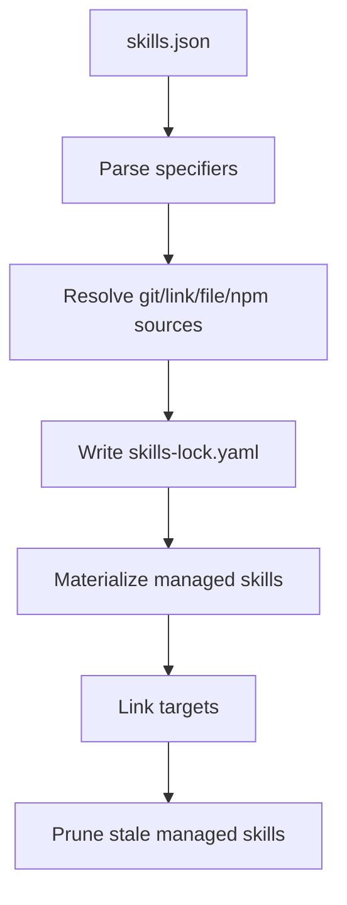

# How it works

The installation flow of skills-package-manager can be understood as three stages: resolve, materialize, and link.

## 1. Resolve specifiers

The installer first reads `skills.json` and resolves each skill specifier:

- GitHub shorthand: `owner/repo`
- Git URL: `https://github.com/owner/repo.git`
- Git URL + `path:`
- Git URL + `ref` + `path:`
- Local `link:` skills
- Local `file:` tarballs
- `npm:` package sources

## 2. Generate resolutions

Different sources produce different resolution records:

- `git`: resolved to repository URL, commit, and skill path
- `link`: resolved to a local path and content digest
- `file`: resolved to a local tarball path and skill path
- `npm`: resolved to a package name, version, and skill path

These results are written to the lockfile for reuse and auditing.

## 3. Materialize into installDir

The installer copies skill files into a managed directory under `installDir`, ensuring the agent can reliably read the installed skill content.

## 4. Link to target directories

The system then syncs links to `linkTargets`, for example:

- `.claude/skills`
- Other agent-specific skill directories

## 5. Prune old skills

For skills no longer managed by the manifest, the installation flow performs cleanup to avoid stale content remaining in `installDir`.

## Design goals

The goal of this flow is not to treat skills as ordinary npm packages, but to bring “AI agent capability units” into an engineering workflow:

- Declarative
- Reproducible
- Linkable
- Updatable
- Auditable
