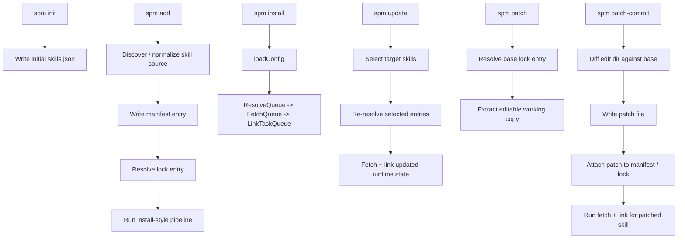
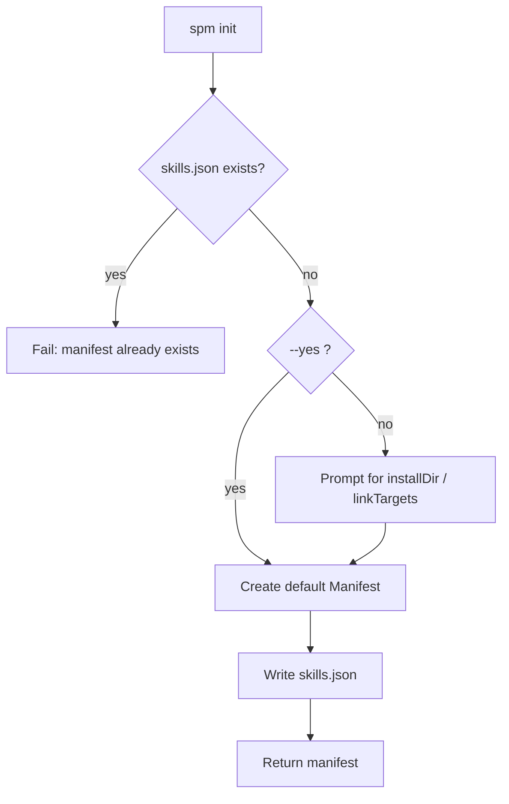
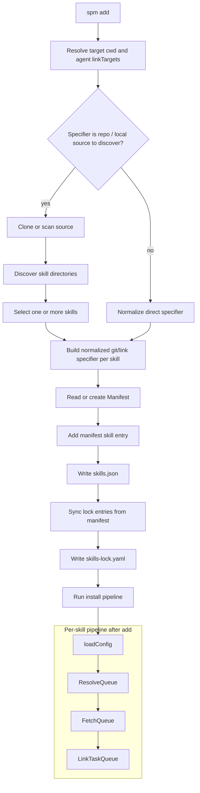
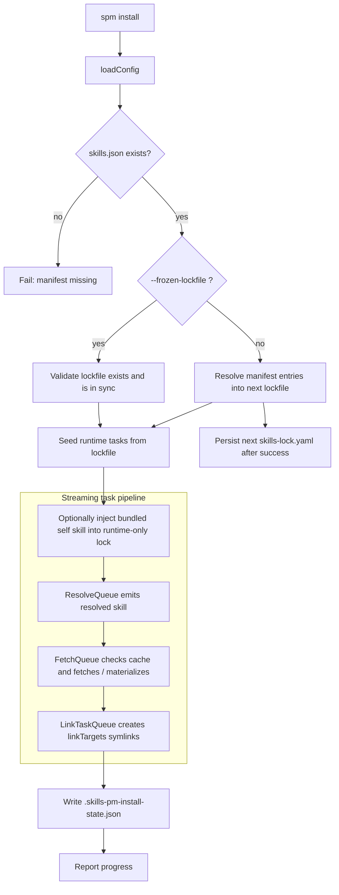
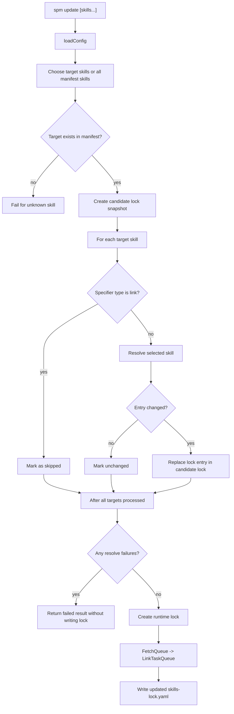
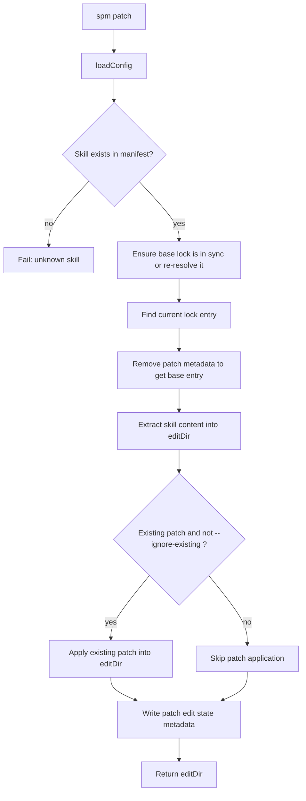
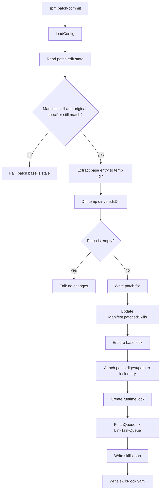

# How it works

This page is a workflow-first view of `skills-package-manager`.

It is intentionally drawn as a refactor-oriented mental model:

- Start from top-level CLI commands
- Move through `loadConfig`
- Then think in terms of `ResolveQueue`, `FetchQueue`, and `LinkTaskQueue`
- Avoid hiding the flow behind a single large orchestrator object

The goal is to make the runtime easy to reason about before introducing concurrency and cache layers.

## Core runtime flow

At the center, every command is some variation of this shared flow:

1. `loadConfig`
2. produce or reuse resolution tasks
3. enqueue fetch work as soon as a resolution is available
4. enqueue link work as soon as a fetch is available
5. persist the resulting manifest / lock / install state when needed

The important point is that `resolve`, `fetch`, and `link` are **pipeline stages**, not strict global barriers. A skill can move from resolve to fetch before every other skill has finished resolving.

```mermaid
flowchart LR
    A["CLI command"] --> B["loadConfig()"]

    subgraph LoadConfig ["loadConfig"]
      B1["Read skills.json"]
      B2["Read skills-lock.yaml"]
      B3["Read .npmrc and source-specific config"]
      B4["Normalize Manifest / Specifier / Lockfile defaults"]
      B5["If installDir exists, read .skills-pm-install-state.json"]
    end

    B --> B1 --> B2 --> B3 --> B4 --> B5
    B5 --> C["Seed ResolveQueue"]

    subgraph ResolveStage ["ResolveQueue"]
      C1["Parse manifest skill entries"]
      C2{"ResolverRegistry"}
      C3["GitResolver"]
      C4["NpmResolver"]
      C5["FileResolver"]
      C6["LinkResolver"]
      C7["Emit resolved task"]
    end

    C --> C1 --> C2
    C2 --> C3 --> C7
    C2 --> C4 --> C7
    C2 --> C5 --> C7
    C2 --> C6 --> C7

    C7 --> D["Push into FetchQueue immediately"]

    subgraph FetchStage ["FetchQueue"]
      D1["Check KV cache / local cache"]
      D2{"Cache hit?"}
      D3["Reuse tarball / checkout / digest metadata"]
      D4["Fetch from npm / git / file source"]
      D5["Materialize into installDir"]
      D6["Apply patch if lock entry includes patch"]
      D7["Emit fetched task"]
    end

    D --> D1 --> D2
    D2 -->|yes| D3 --> D5
    D2 -->|no| D4 --> D5
    D5 --> D6 --> D7

    D7 --> E["Push into LinkTaskQueue immediately"]

    subgraph LinkStage ["LinkTaskQueue"]
      E1["Ensure installDir and link target dirs exist"]
      E2["Prune stale managed skills if needed"]
      E3["Create / replace symlink in each linkTarget"]
      E4["Update install state"]
    end

    E --> E1 --> E2 --> E3 --> E4
```

## Shared stages

### 1. `loadConfig`

`loadConfig` should produce a single in-memory view of all relevant inputs:

- `Manifest`
- `Lockfile`
- parsed / normalized `Specifier`s
- source config such as `.npmrc`
- install state from `.skills-pm-install-state.json` if `installDir` already exists

The key rule is: defaults are applied here, once.

### 2. `ResolveQueue`

`ResolveQueue` turns manifest declarations into concrete resolution records.

Examples:

- `git` resolves to `repo + commit + path`
- `npm` resolves to `package + version + registry + tarball + integrity + path`
- `file` resolves to `tarball + path`
- `link` resolves to `local path + digest`

As soon as one skill has a complete resolution, it can be pushed into `FetchQueue`.

### 3. `FetchQueue`

`FetchQueue` is responsible for obtaining or reusing concrete source artifacts and turning them into installed skill content.

This is the natural place for:

- remote fetches
- tarball download reuse
- git checkout reuse
- KV cache
- content-addressed cache
- source-level integrity checks

### 4. `LinkTaskQueue`

`LinkTaskQueue` is the final filesystem-facing stage:

- ensure managed directories exist
- prune stale managed skills
- create or replace symlinks into `linkTargets`
- update install state

## Command overview

Different CLI commands enter the shared pipeline at different points:

## `spm init`

`init` is the only command that does not enter the install pipeline. It creates the initial manifest.

## `spm add`

`add` has two parts:

1. source discovery / specifier normalization
2. manifest + lock update followed by an install-style pipeline

## `spm install`

`install` is the cleanest expression of the package manager pipeline.

## `spm update`

`update` is like a partial install: only selected skills are re-resolved, but the resulting runtime state is still fetched and linked.

## `spm patch`

`patch` prepares an editable working directory from the currently resolved skill content.

## `spm patch-commit`

`patch-commit` turns an edited working tree back into:

- a patch file on disk
- updated `patchedSkills` in the manifest
- updated patch metadata in the lockfile
- refreshed installed content

## Design goals

This queue-oriented model is trying to make the package manager easy to evolve in three directions:

- **Concurrency**: one skill can advance to fetch or link without waiting for every other skill
- **Caching**: resolve and fetch outputs have explicit handoff points
- **Debuggability**: the user can trace the flow from command function to queue to filesystem effect
