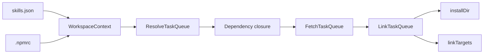

# How it works

The installation flow is built around a unified pipeline with three concurrent task queues: **resolve**, **fetch**, and **link**. `spm install` resolves `skills.json`, discovers recursive `SKILL.md` frontmatter dependencies, and streams the final install plan through the pipeline.

## 1. Load configuration

The pipeline starts by loading:

- `skills.json`
- `.npmrc` npm registry config

## 2. Resolve specifiers

The resolver turns manifest specifiers into install-plan entries:

- `github:` and git URL sources resolve to a concrete commit
- `npm:` sources resolve to package metadata and tarball details
- `file:` tarballs resolve to a local package path and skill subpath
- `link:` and `local:` sources resolve to local directories

## 3. Discover skill dependencies

After a skill is resolved, its patched `SKILL.md` frontmatter can contribute top-level `dependencies`. These dependencies use the same specifier syntax as `skills.json`, are resolved recursively, and are written back to `skills.json.dependencies` as pinned lock entries after install succeeds.

## 4. Fetch into installDir

Resolved skills are fetched into `installDir`. The npm fetcher uses a persistent tarball cache to avoid redundant downloads.

## 5. Link to target directories

Fetched skills flow into the link queue, which creates symlinks from `installDir` to each `linkTarget` directory.

## 6. Prune old skills

Before fetch begins, managed skills that are no longer declared in `skills.json` or reachable through dependencies are removed from `installDir` and `linkTargets`.

## Pipeline architecture

```mermaid
flowchart LR
    A["skills.json"] --> B["WorkspaceContext"]
    C[".npmrc"] --> B
    B --> E["ResolveTaskQueue"]
    E --> D["Dependency closure"]
    D --> F["FetchTaskQueue"]
    F --> G["LinkTaskQueue"]
    G --> H["installDir"]
    G --> I["linkTargets"]
```

## Design goals

- **Declarative**: `skills.json` is the single source of truth.
- **Pinned**: Git commits and npm versions live directly in `skills.json`.
- **Linkable**: One install can serve many agent directories.
- **Updatable**: `spm update` selectively refreshes git and npm pins.
- **Concurrent**: Pipeline parallelism minimizes install time.
