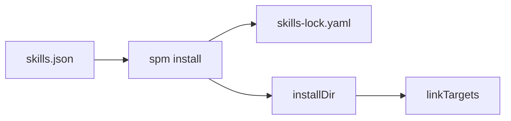

# Getting started

## Install

The simplest way is to run the CLI directly with `npx`:

```bash
npx skills-package-manager add vercel-labs/skills --skill find-skills
```

If you have already integrated this repository into your project, you can also call `spm` directly:

```bash
spm install
```

## Add a GitHub skill

```bash
# Interactive: scan the repository and choose a skill
npx skills-package-manager add vercel-labs/skills

# Specify the skill name
npx skills-package-manager add vercel-labs/skills --skill find-skills

# Point to a full repository URL
npx skills-package-manager add https://github.com/rstackjs/agent-skills --skill rspress-custom-theme
```

## Add a local skill

```bash
npx skills-package-manager add file:./local-source#path:/skills/my-skill
```

## Initialize the manifest

A minimal usable `skills.json` looks like this:

```json
{
  "installDir": ".agents/skills",
  "linkTargets": [".cursor/skills"],
  "skills": {
    "find-skills": "https://github.com/vercel-labs/skills.git#path:/skills/find-skills"
  }
}
```

## Install all skills

```bash
npx skills-package-manager install
```

This step will:

1. Resolve `skills.json`
2. Generate or update `skills-lock.yaml`
3. Materialize skills into `installDir`
4. Create or refresh symbolic links under `linkTargets`

## Update declared skills

```bash
npx skills-package-manager update
npx skills-package-manager update find-skills rspress-custom-theme
```

## Use with pnpm

If you want skills to be installed automatically during every `pnpm install`:

```bash
pnpm add pnpm-plugin-skills --config
```

Then create `skills.json`, and the plugin will automatically install skills during the pnpm lifecycle.


